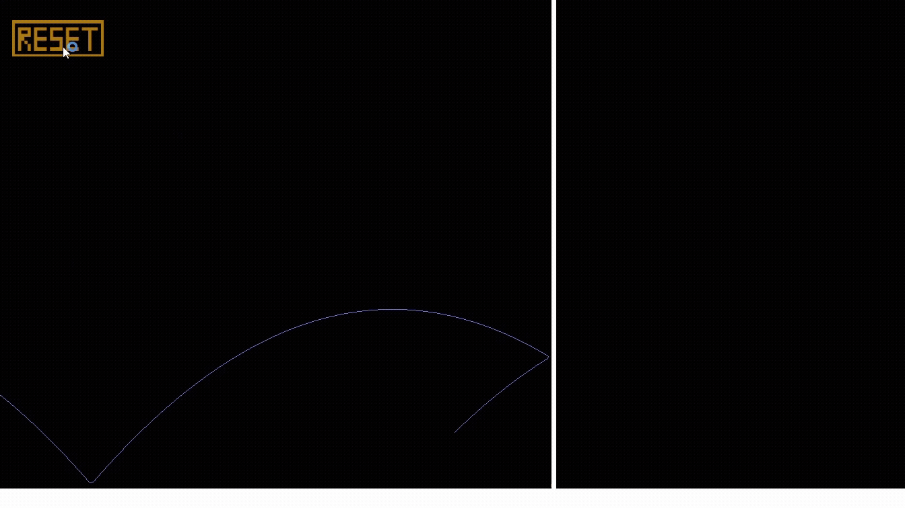

# 🚀 Rocket Flight Simulator --- C++ / OpenGL

A **2D rocket flight simulator** built with **C++ and OpenGL**, focused
on real-time physics, interactive parameter tuning, and modular
engine-style architecture.

The simulator allows experimenting with different physical parameters
such as gravity, thrust, burn time, launch angle, mass, and restitution
to observe how they affect the rocket's trajectory.

The project was built as part of my transition toward **graphics
programming and low-level simulation systems**, implementing everything
from rendering to UI manually using OpenGL.

------------------------------------------------------------------------

# Preview

------------------------------------------------------------------------

# Features

## Physics Simulation

The rocket's flight is simulated using configurable physical parameters:

-   Gravity
-   Thrust
-   Burn time
-   Launch angle
-   Mass
-   Restitution (bounce on ground)
-   Drag

This allows experimentation with how different values influence the
rocket's trajectory.

------------------------------------------------------------------------

## Interactive Parameter Tuning

Parameters can be modified directly through input fields in the UI,
allowing **live experimentation** with the simulation.

Editable values include:

-   Gravity (m/s²)
-   Angle (degrees)
-   Mass (kg)
-   Thrust (N)
-   Burn Time (seconds)
-   Restitution coefficient

------------------------------------------------------------------------

## Trajectory Visualization

The simulator visualizes the rocket's path in real time using a **trail
renderer**, allowing clear observation of the flight arc and landing
point.

------------------------------------------------------------------------

## Physics Debug Visualization

To help understand the motion, the simulator includes visual debugging
tools:

-   Velocity vector arrow
-   Acceleration vector arrow

These update dynamically during flight.

------------------------------------------------------------------------

## Flight Metrics

The simulator tracks and displays important flight data:

-   Maximum height
-   Horizontal range
-   Flight time

------------------------------------------------------------------------

## Custom UI System

A lightweight UI framework built directly in OpenGL includes:

-   Input fields
-   Buttons
-   Text rendering
-   Parameter editing

This was implemented without external UI libraries to better understand
rendering and input pipelines.

------------------------------------------------------------------------

# Tech Stack

-   C++17
-   OpenGL 3.3+
-   GLFW (windowing and input)
-   GLM (math library)
-   Custom shaders
-   STB Image
-   FreeType (text rendering)

------------------------------------------------------------------------

# Project Architecture

The codebase is organized into modular systems to separate
responsibilities and keep the project scalable.

    src/
     ├── Core
     │    ├── Application
     │    ├── InputField
     │    ├── Button
     │    └── UI systems
     │
     ├── Graphics
     │    ├── Shader
     │    ├── Mesh
     │    ├── Texture
     │    ├── TextRenderer
     │    ├── TrailRenderer
     │    ├── Arrow
     │    └── PrimitiveFactory
     │
     ├── Simulation
     │    ├── Rocket2D
     │    └── Physics logic
     │
     └── main.cpp

## Core

Handles the application lifecycle and user interaction:

-   Window initialization
-   UI input handling
-   Button and field management
-   Simulation control

## Graphics

Responsible for rendering systems:

-   Mesh and shader management
-   Textures and materials
-   Trail visualization
-   Debug arrows
-   Primitive generation
-   Text rendering

## Simulation

Contains the physics logic:

-   Rocket motion
-   Thrust application
-   Gravity
-   Collision with the floor
-   Simulation update loop

------------------------------------------------------------------------

# What I Learned

Building this project helped me practice several important areas related
to **graphics and simulation programming**:

-   Structuring a medium-sized C++ OpenGL project
-   Separating rendering systems from simulation logic
-   Implementing a small UI framework from scratch
-   Visualizing physics data using debug tools
-   Working with transformations and vectors
-   Iterating on architecture as features grow

------------------------------------------------------------------------

# How to Run

### 1. Clone the repository

    git clone https://github.com/DannyLopezC/PhysicsSimulator.git
    cd PhysicsSimulator

### 2. Open the Visual Studio solution

Open the `.sln` file in Visual Studio.

### 3. Build the project

Compile the solution using the default configuration.

### 4. Run

Launch the executable from Visual Studio.

------------------------------------------------------------------------

# Controls

-   Edit simulation parameters through the input fields
-   Press **RESET** to restart the simulation with the current values

------------------------------------------------------------------------

# Future Improvements

Possible extensions for the simulator:

-   Camera zoom and pan
-   Real-time graphs (height vs time)
-   Multiple rocket types
-   Improved UI layout and styling
-   Exporting simulation data

------------------------------------------------------------------------

# Author

Danny López Cárdenas\
Game Developer transitioning into Graphics Programming

GitHub\
https://github.com/DannyLopezC

Portfolio\
https://dannylopezc.github.io/

LinkedIn\
https://www.linkedin.com/in/dannylopezc
